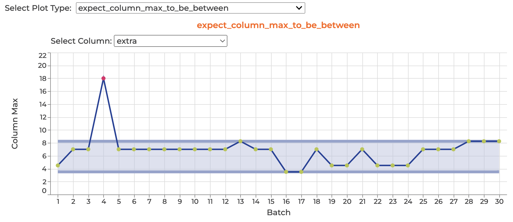
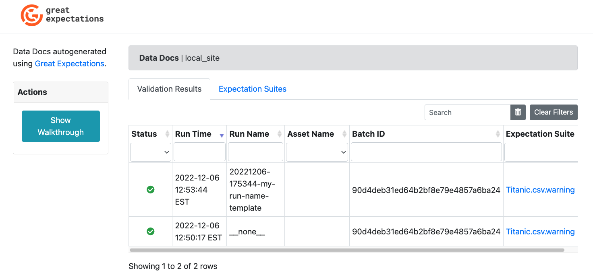
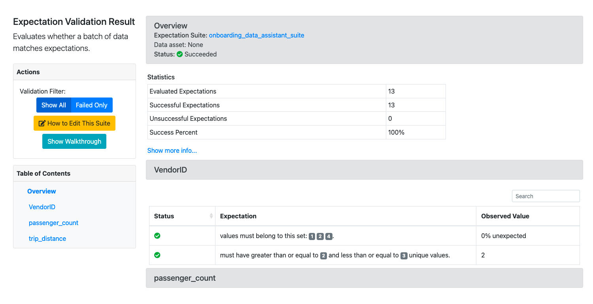

<!-- <<<Super-quickstart links go here>>> -->


Great Expectations
================================================================================

*Always know what to expect from your data.*

What is GX?
--------------------------------------------------------------------------------

Great Expectations (GX) helps data teams build a shared understanding of their data through quality testing, documentation, and profiling.

Data practitioners know that testing and documentation are essential for managing complex data pipelines. GX makes it possible for data science and engineering teams to quickly deploy extensible, flexible data quality testing into their data stacks. Its human-readable documentation makes the results accessible to technical and nontechnical users.

[See Down with Pipeline Debt!](https://greatexpectations.io/blog/down-with-pipeline-debt-introducing-great-expectations/) for an introduction to our philosophy of pipeline data quality testing.


<!--
--------------------------------------------------
<<<A bunch of logos go here for social proof>>>

--------------------------------------------------
-->

Key features
--------------------------------------------------

### Seamless operation

GX fits into your existing tech stack, and can integrate with your CI/CD pipelines to add data quality exactly where you need it. Connect to and validate your data wherever it already is, so you can focus on honing your Expectation Suites to perfectly meet your data quality needs.

### Start fast

Get useful results quickly even for large data volumes. GX’s Data Assistants provide curated Expectations for different domains, so you can accelerate your data discovery to rapidly deploy data quality throughout your pipelines. Auto-generated Data Docs ensure your DQ documentation will always be up-to-date.




### Unified understanding

Expectations are GX’s workhorse abstraction: each Expectation declares an expected state of the data. The Expectation library provides a flexible, extensible vocabulary for data quality—one that’s human-readable, meaningful for technical and nontechnical users alike. Bundled into Expectation Suites, Expectations are the ideal tool for characterizing exactly what you expect from your data.

- `expect_column_values_to_not_be_null`
- `expect_column_values_to_match_regex`
- `expect_column_values_to_be_unique`
- `expect_column_values_to_match_strftime_format`
- `expect_table_row_count_to_be_between`
- `expect_column_median_to_be_between`
- ...and [many more](https://greatexpectations.io/expectations)

### Secure and transparent

GX doesn’t ask you to exchange security for your insight. It processes your data in place, on your systems, so your security and governance procedures can maintain control at all times. And because GX’s core is and always will be open source, its complete transparency is the opposite of a black box.

### Data contracts support

Checkpoints are a transparent, central, and automatable mechanism for testing Expectations and evaluating your data quality. Every Checkpoint run produces human-readable Data Docs reporting the results. You can also configure Checkpoints to take Actions based on the results of the evaluation, like sending alerts and preventing low-quality data from moving further in your pipelines.



### Readable for collaboration

Everyone stays on the same page about your data quality with GX’s inspectable, shareable, and human-readable Data Docs. You can publish Data Docs to the locations where you need them in a variety of formats, making it easy to integrate Data Docs into your existing data catalogs, dashboards, and other reporting and data governance tools.



Quick start
-------------------------------------------------------------

To see Great Expectations in action on your own data:

You can install it using pip
```
pip install great_expectations
```
and then run

```
great_expectations init
```

Integrations
-------------------------------------------------------------------------------
Great Expectations works with the tools and systems that you're already using with your data, including:

<table style="background-color: #fff;">
	<thead>
		<tr>
			<th colspan="2">Integration</th>
			<th>Notes</th>
		</tr>
	</thead>
	<tbody>
		<tr>
			<td style="text-align: center; height: 40px; background-color: #fff;">
				
			</td>
			<td style="width: 200px;">
				<a href="https://docs.greatexpectations.io/docs/integrations/integration_datahub/">
					DataHub
				</a>
			</td>
			<td>
				Data Catalog
			</td>
		</tr>
		<tr>
			<td style="text-align: center; height: 40px; background-color: #fff;">
				
			</td>
			<td style="width: 200px;">
				<a href="https://docs.greatexpectations.io/docs/deployment_patterns/how_to_use_great_expectations_in_aws_glue/">
					AWS Glue
				</a>
			</td>
			<td>
				Data Integration
			</td>
		</tr>
		<tr>
			<td style="text-align: center; height: 40px; background-color: #fff;">
				
			</td>
			<td style="width: 200px;">
				<a href="https://docs.greatexpectations.io/docs/guides/connecting_to_your_data/database/athena/">
					Athena
				</a>
			</td>
			<td>
				Data Source
			</td>
		</tr>
		<tr>
			<td style="text-align: center; height: 40px; background-color: #fff;">
				
			</td>
			<td style="width: 200px;">
				<a href="https://docs.greatexpectations.io/docs/guides/connecting_to_your_data/database/redshift/">
					AWS Redshift
				</a>
			</td>
			<td>
				Data Source
			</td>
		</tr>
		<tr>
			<td style="text-align: center; height: 40px; background-color: #fff;">
				
			</td>
			<td style="width: 200px;">
				<a href="https://docs.greatexpectations.io/docs/guides/setup/configuring_data_docs/how_to_host_and_share_data_docs_on_amazon_s3/">
					AWS S3
				</a>
			</td>
			<td>
				Data Source
			</td>
		</tr>
		<tr>
			<td style="text-align: center; height: 40px; background-color: #fff;">
				
			</td>
			<td style="width: 200px;">
				<a href="https://docs.greatexpectations.io/docs/deployment_patterns/how_to_use_great_expectations_with_google_cloud_platform_and_bigquery/">
					BigQuery
				</a>
			</td>
			<td>
				Data Source
			</td>
		</tr>
		<tr>
			<td style="text-align: center; height: 40px; background-color: #fff;">
				
			</td>
			<td style="width: 200px;">
				<a href="https://docs.greatexpectations.io/docs/deployment_patterns/how_to_use_great_expectations_in_databricks/">
					Databricks
				</a>
			</td>
			<td>
				Data Source
			</td>
		</tr>
		<tr>
			<td style="text-align: center; height: 40px; background-color: #fff;">
				
			</td>
			<td style="width: 200px;">
				<a href="https://docs.greatexpectations.io/docs/deployment_patterns/how_to_use_great_expectations_in_deepnote/">
					Deepnote
				</a>
			</td>
			<td>
				Collaborative data notebook
			</td>
		</tr>
		<tr>
			<td style="text-align: center; height: 40px; background-color: #fff;">
				
			</td>
			<td style="width: 200px;">
				<a href="https://docs.greatexpectations.io/docs/deployment_patterns/how_to_use_great_expectations_with_google_cloud_platform_and_bigquery/">
					Google Cloud Platform &#40;GCP&#41;
				</a>
			</td>
			<td>
				Data Source
			</td>
		</tr>
		<tr>
			<td style="text-align: center; height: 40px; background-color: #fff;">
				
			</td>
			<td style="width: 200px;">
				<a href="https://docs.greatexpectations.io/docs/guides/setup/configuring_data_docs/how_to_host_and_share_data_docs_on_azure_blob_storage/">
					Microsoft Azure Blob Storage
				</a>
			</td>
			<td>
				Data Source
			</td>
		</tr>
		<tr>
			<td style="text-align: center; height: 40px; background-color: #fff;">
				
			</td>
			<td style="width: 200px;">
				<a href="https://docs.greatexpectations.io/docs/guides/connecting_to_your_data/database/mssql">
					Microsoft SQL Server
				</a>
			</td>
			<td>
				Data Source
			</td>
		</tr>
		<tr>
			<td style="text-align: center; height: 40px; background-color: #fff;">
				
			</td>
			<td style="width: 200px;">
				<a href="https://docs.greatexpectations.io/docs/guides/connecting_to_your_data/database/mysql/">
					MySQL
				</a>
			</td>
			<td>
				Data Source
			</td>
		</tr>
		<tr>
			<td style="text-align: center; height: 40px; background-color: #fff;">
				
			</td>
			<td style="width: 200px;">
				<a href="https://docs.greatexpectations.io/docs/guides/connecting_to_your_data/in_memory/pandas/">
					Pandas
				</a>
			</td>
			<td>
				Data Source
			</td>
		</tr>
		<tr>
			<td style="text-align: center; height: 40px; background-color: #fff;">
				
			</td>
			<td style="width: 200px;">
				<a href="https://docs.greatexpectations.io/docs/guides/connecting_to_your_data/database/postgres/">
					PostgreSQL
				</a>
			</td>
			<td>
				Data Source
			</td>
		</tr>
		<tr>
			<td style="text-align: center; height: 40px; background-color: #fff;">
				
			</td>
			<td style="width: 200px;">
				<a href="https://docs.greatexpectations.io/docs/guides/connecting_to_your_data/database/snowflake/">
					Snowflake
				</a>
			</td>
			<td>
				Data Source
			</td>
		</tr>
		<tr>
			<td style="text-align: center; height: 40px; background-color: #fff;">
				
			</td>
			<td style="width: 200px;">
				<a href="https://docs.greatexpectations.io/docs/deployment_patterns/how_to_instantiate_a_data_context_on_an_emr_spark_cluster/">
					Spark
				</a>
			</td>
			<td>
				Data Source
			</td>
		</tr>
		<tr>
			<td style="text-align: center; height: 40px; background-color: #fff;">
				
			</td>
			<td style="width: 200px;">
				<a href="https://docs.greatexpectations.io/docs/guides/connecting_to_your_data/database/sqlite/">
					SQLite
				</a>
			</td>
			<td>
				Data Source
			</td>
		</tr>
		<tr>
			<td style="text-align: center; height: 40px; background-color: #fff;">
				
			</td>
			<td style="width: 200px;">
				<a href="https://docs.greatexpectations.io/docs/guides/connecting_to_your_data/database/trino/">
					Trino
				</a>
			</td>
			<td>
				Data Source
			</td>
		</tr>
		<tr>
			<td style="text-align: center; height: 40px; background-color: #fff;">
				
			</td>
			<td style="width: 200px;">
				<a href="https://docs.greatexpectations.io/docs/deployment_patterns/how_to_use_great_expectations_with_airflow/">
					Apache Airflow
				</a>
			</td>
			<td>
				Orchestrator
			</td>
		</tr>
		<tr>
			<td style="text-align: center; height: 40px; background-color: #fff;">
				
			</td>
			<td style="width: 200px;">
				<a href="https://docs.greatexpectations.io/docs/deployment_patterns/how_to_use_great_expectations_in_flyte/">
					Flyte
				</a>
			</td>
			<td>
				Orchestrator
			</td>
		</tr>
		<tr>
			<td style="text-align: center; height: 40px; background-color: #fff;">
				
			</td>
			<td style="width: 200px;">
				<a href="https://docs.greatexpectations.io/docs/deployment_patterns/how_to_use_great_expectations_with_meltano/">
					Meltano
				</a>
			</td>
			<td>
				Orchestrator
			</td>
		</tr>
		<tr>
			<td style="text-align: center; height: 40px; background-color: #fff;">
				
			</td>
			<td style="width: 200px;">
				<a href="https://docs.greatexpectations.io/docs/deployment_patterns/how_to_use_great_expectations_with_prefect/">
					Prefect
				</a>
			</td>
			<td>
				Orchestrator
			</td>
		</tr>
		<tr>
			<td style="text-align: center; height: 40px; background-color: #fff;">
				
			</td>
			<td style="width: 200px;">
				<a href="https://docs.greatexpectations.io/docs/integrations/integration_zenml/">
					ZenML
				</a>
			</td>
			<td>
				Orchestrator
			</td>
		</tr>
		<tr>
			<td style="text-align: center; height: 40px; background-color: #fff;">
				
			</td>
			<td style="width: 200px;">
				<a href="https://docs.greatexpectations.io/docs/guides/validation/validation_actions/how_to_trigger_slack_notifications_as_a_validation_action/">
					Slack
				</a>
			</td>
			<td>
				Plugin
			</td>
		</tr>
		<tr>
			<td style="text-align: center; height: 40px; background-color: #fff;">
				
			</td>
			<td style="width: 200px;">
				<a href="https://docs.greatexpectations.io/docs/tutorials/getting_started/tutorial_create_expectations/#creating-expectations-in-jupyter-notebooks">
					Jupyter Notebooks
				</a>
			</td>
			<td>
				Utility
			</td>
		</tr>
	</tbody>
</table>


What is GX _not_?
-------------------------------------------------------------

Great Expectations is _not_ a pipeline execution framework. Instead, it integrates seamlessly with DAG execution tools like [Spark]( https://spark.apache.org/), [Airflow](https://airflow.apache.org/), [dbt]( https://www.getdbt.com/), [prefect](https://www.prefect.io/), [dagster]( https://github.com/dagster-io/dagster), [Kedro](https://github.com/quantumblacklabs/kedro), [Flyte](https://flyte.org/), etc. GX carries out your data quality pipeline testing while these tools execute the pipelines.

Great Expectations is _not_ a database or storage software. It processes your data in place, on your existing systems. Expectations and Validation Results that GX produces are metadata about your data.

Great Expectations is _not_ a data versioning tool. If you want to bring your data itself under version control, check out tools like [DVC](https://dvc.org/), [Quilt](https://github.com/quiltdata/quilt), and [lakeFS](https://github.com/treeverse/lakeFS/).

Great Expectations is _not_ a language-agnostic platform. Instead, it follows the philosophy of “take the compute to the data” by using the popular Python language to support native execution of Expectations in pandas, SQL (via SQLAlchemy), and Spark environments.

Great Expectations is _not_ exclusive to Python programming environments. It can be invoked from the command line without a Python environment. However, if you’re working into another ecosystem, you may want to explore ecosystem-specific alternatives such as [assertR](https://github.com/ropensci/assertr) (for R environments) or [TFDV](https://www.tensorflow.org/tfx/guide/tfdv) (for Tensorflow environments).

